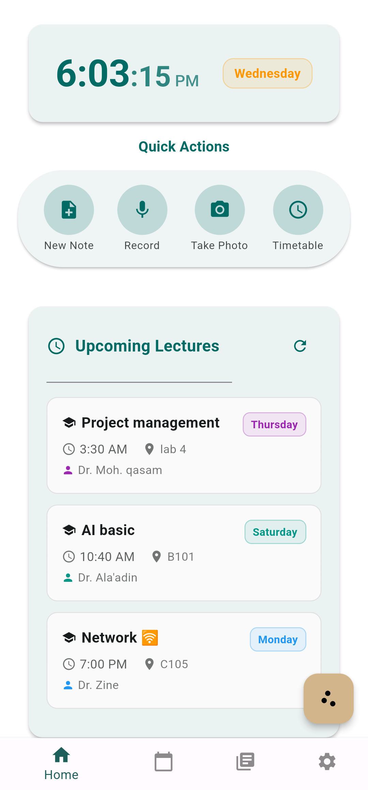
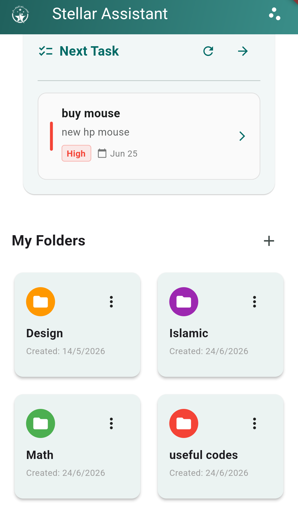
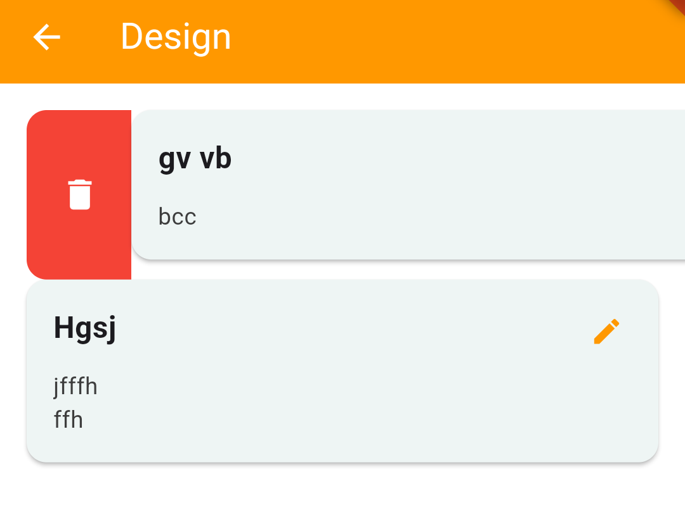
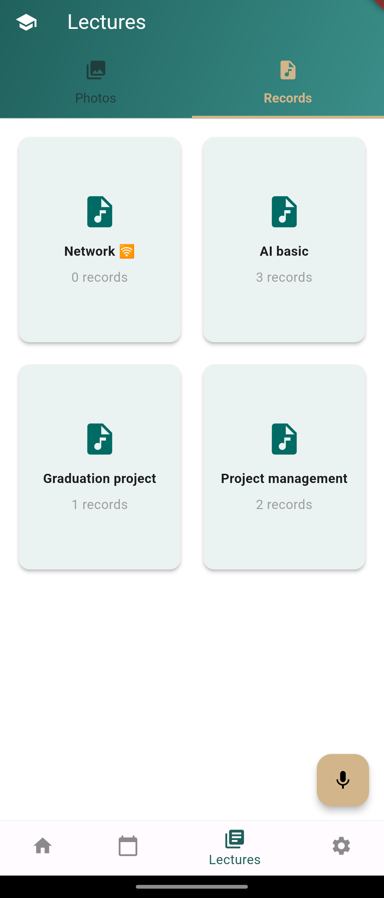
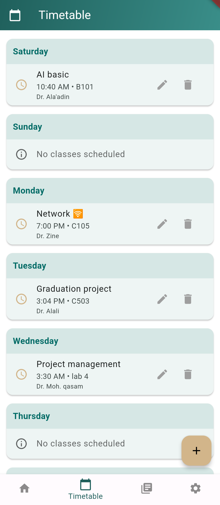
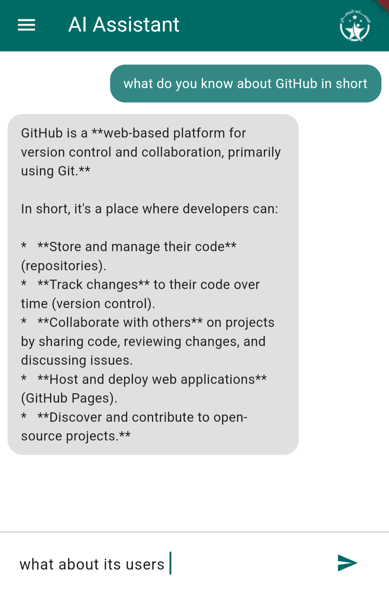
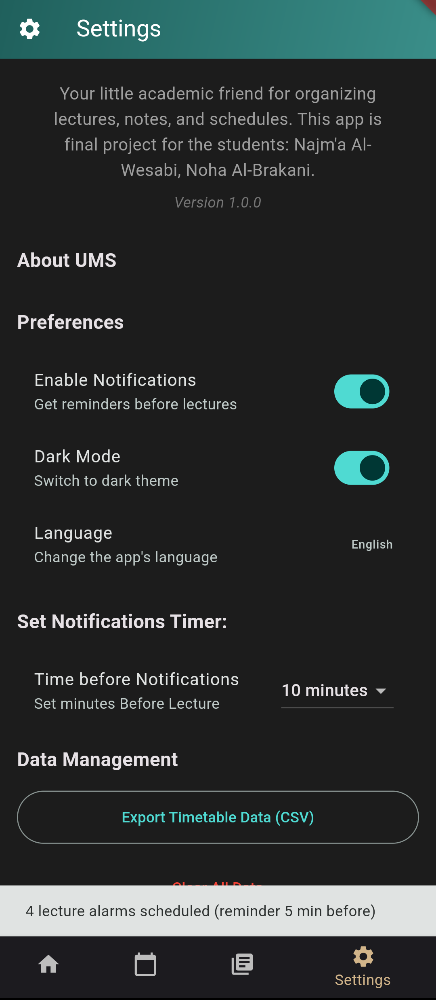

# 📚 SmartStallerAssistant

A comprehensive mobile application designed to help students manage their academic life efficiently. Built with Flutter, this app provides tools for timetable management, note-taking, lecture recording, AI-powered assistance, and task management.

## ✨ Features

### 📅 Timetable Management
- Add, edit, and delete lecture schedules
- Weekly timetable view with day-by-day organization
- Automatic lecture reminders and alarms
- Support for professor names and room numbers


### ✅ To-Do List & 📝 Notes & Folders
- Create tasks with priority levels (Low/Medium/High)
- Set due dates for tasks
- Filter by All/Pending/Completed
- Edit and delete tasks
- Quick preview on home screen


- Create color-coded folders for organization
- Add, edit, and delete notes within folders
- Expandable note cards with content preview
- Swipe to delete functionality


### 🎙️ Lecture Recording & Photos
- Record audio lectures with pause/resume capability
- Capture photos during lectures
- Organize media by subject
- Playback recordings with progress bar
- Share photos and recordings
- Delete media with confirmation



### 🤖 AI Assistant
- Integrated Gemini AI chat assistant


### ⚙️ Settings
- Dark/Light theme toggle
- Language support (English/Arabic)
- Notification preferences
- Customizable reminder timing
- Export timetable as CSV
- Clear all data option

### 🌐 Localization
- Full Arabic and English support
- Right-to-left (RTL) layout support for Arabic
- All UI elements localized
- Dynamic language switching

## 📱 Screenshots

The app includes the following main screens:
- **Home Screen**: Dashboard with clock, quick actions, upcoming lectures, todo preview, and folders
- **Timetable Screen**: Weekly schedule management
- **Lectures Screen**: Media organization by subject
- **AI Chat Screen**: Gemini AI-powered assistant
- **Settings Screen**: App preferences and data management
- **Todo Screen**: Full task management interface

## 🛠️ Technical Architecture

### Core Services
- **DatabaseService**: SQLite database operations using sqflite
- **NotificationService**: Push notifications and alarms
- **AudioService**: Audio recording and playback
- **FileStorageService**: File management for photos and recordings
- **AlarmService**: Scheduled alarms for lecture reminders

### State Management
- Stateful widgets with setState for local state
- Shared preferences for settings
- Database persistence for all data

### Dependencies
```yaml
dependencies:
  flutter:
    sdk: flutter
  sqflite: ^2.3.0
  path_provider: ^2.1.0
  google_generative_ai: ^0.4.0
  just_audio: ^0.9.36
  record: ^5.0.0
  image_picker: ^1.0.4
  share_plus: ^10.0.0
  flutter_local_notifications: ^17.0.0
  alarm: ^3.0.0
  intl: ^0.19.0
  uuid: ^4.3.3
  csv: ^5.1.1
  permission_handler: ^11.0.0
  timezone: ^0.9.2
  flutter_timezone: ^1.0.8
  url_launcher: ^6.2.5
  ```
## 🚀 Getting Started

### Prerequisites
Before you begin, ensure you have the following installed:
- Flutter SDK (^3.0.0) - [Installation Guide](https://docs.flutter.dev/get-started/install)
- Android Studio / VS Code with Flutter extensions
- Android SDK (for Android development)
- iOS SDK and Xcode (for iOS development, macOS only)
- Git (for version control)

### Installation

1. **Clone the repository**
```bash
git clone https://github.com/DangerousAngel/SmartStallerAssistant.git
cd SmartStallerAssistant
flutter pub get
flutter gen-l10n
```
## Set up Gemini API Key

1. **Open lib/screens/ai_chat_screen.dart**
2. Locate the line: String geminiApiKey = "YOUR_KEY";
3. Replace it with your own Gemini API key from Google AI Studio

### 📁 Project Structure
```text
student_assistance_app/
├── lib/
│   ├── main.dart                 # App entry point
│   ├── screens/                  # Screen widgets
│   │   ├── home_screen.dart
│   │   ├── timetable_screen.dart
│   │   ├── lectures_screen.dart
│   │   ├── settings_screen.dart
│   │   ├── ai_chat_screen.dart
│   │   ├── todo_screen.dart
│   │   └── folder_detail_screen.dart
│   ├── services/                 # Business logic
│   │   ├── database_service.dart
│   │   ├── notification_service.dart
│   │   ├── audio_service.dart
│   │   └── file_storage_service.dart
│   ├── widgets/                  # Reusable components
│   │   ├── todo_list.dart
│   │   ├── todo_preview.dart
│   │   ├── upcoming_lectures.dart
│   │   ├── clock.dart
│   │   ├── quick_actions.dart
│   │   ├── folder_card.dart
│   │   ├── gradient_app_bar.dart
│   │   ├── subject_selection_bottom_sheet.dart
│   │   ├── build_content.dart
│   │   ├── build_photos.dart
│   │   └── build_records.dart
│   └── l10n/                     # Localization files
│       ├── app_en.arb
│       └── app_ar.arb
├── assets/                       # App assets
│   ├── ic_launcher.png
│   └── notify_da.mp3
├── pubspec.yaml                   # Dependencies and configuration
└── README.md                     # This file
```

